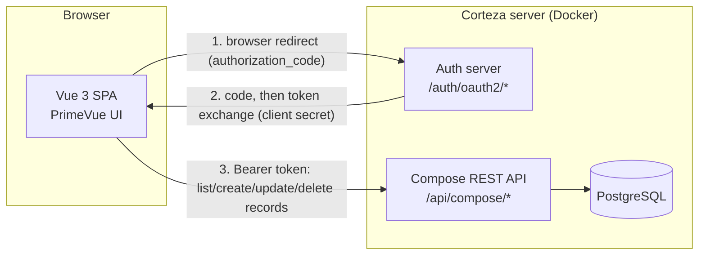

# Plexys Homework — Support Ticket SPA

Documentation draft (Markdown source — will be converted to a 5–6 page PDF for submission).

> **[SCREENSHOT]** markers show where a screenshot should be inserted before PDF export.

---

## Page 1 — Overview & Architecture

### Summary

A Vue 3 single-page application that manages Corteza `Support Ticket` records (list, create, edit,
delete), authenticating as the real signed-in Corteza user via OAuth2 `authorization_code`, so
Corteza's own audit fields (`createdBy`, `updatedBy`, `ownedBy`) and RBAC stay meaningful with no
custom plumbing.

> **Live demo (temporary):** the app can be exposed with a free Cloudflare quick tunnel
> (`cloudflared tunnel --url http://localhost:5175`) pointed at the local Vite dev server, which
> already proxies `/api` and `/auth` to the local Corteza instance — no separate tunnel or CORS
> setup needed for Corteza itself. This is tied to the developer's machine staying on (dev server,
> Docker, and tunnel all running) and is not a persistent deployment — see "Production hosting"
> on Page 5 for the real deployment plan.

### Stack

| Layer | Choice | Why |
|---|---|---|
| Backend | Corteza `2024.9` (Docker Compose: `cortezaproject/corteza:2024.9` + `postgres:15`) | Version pinned to match the official DevOps guide used for setup; a recent stable release with documented OAuth2/REST behaviour we could verify against source. |
| Frontend framework | Vue 3, Composition API, TypeScript, Vite | Required by the brief; Vite gives fast dev iteration and a trivial static build for deployment. |
| UI library | PrimeVue 5 (Aura theme) | Full component set (Dialog, DataTable, Card, SelectButton, Toast, ConfirmDialog) covers every required interaction without hand-rolling accessible widgets from scratch. |
| Corteza client | `@cortezaproject/corteza-js` (official, framework-agnostic REST client) | Confirmed (not guessed) against the package's own compiled source and Corteza's `compose.yaml` OpenAPI spec: exposes `recordList/recordCreate/recordUpdate/recordDelete`, `namespaceList`, `moduleList`, auto-unwraps Corteza's `{response:...}`/`{error:...}` envelope, and accepts an `accessTokenFn` for bearer-token injection. `@cortezaproject/corteza-vue` was rejected — it pins Vue 2.7 + Bootstrap-Vue and would drag in a parallel legacy UI stack. |
| Auth | Hand-rolled `useAuth` composable implementing OAuth2 `authorization_code` | See Page 3. |

### Architecture diagram



### How the app is served

Corteza supports serving a custom app **inside its own process** (the mechanism behind its
first-party Compose/Admin/Workflow webapps — `HTTP_WEBAPP_LIST`/`HTTP_WEBAPP_BASE_DIR`, all
served same-origin, no CORS needed) or as a **fully standalone SPA** talking to Corteza purely
over REST/OAuth2.

We use the **standalone SPA** approach. The native/bundled route was investigated first (not
skipped by default) and rejected because its webapp assets are compiled into the official Docker
image itself — adding our own app there would mean extending/rebuilding that image, which is
disproportionate effort for this task's time budget. A standalone SPA is simpler, keeps the
Corteza image untouched, and is a fully supported, documented deployment pattern. In development,
a Vite proxy makes the SPA/API/auth server same-origin (avoiding CORS); in production the
equivalent role would be played by a small reverse-proxy layer (see "Next steps").

### Why not Compose Pages?

Corteza's Compose module already ships a low-code **Pages** feature with built-in Record
List/Record view/edit blocks — meaning generic CRUD UI for any module, including Support Ticket,
already exists with zero code. We deliberately did not use it: the assignment explicitly asks for
a hand-built Vue SPA to assess front-end engineering ability, and Compose Pages are *configured*,
not *coded*. Compose's UI was used only for the required one-time module setup and demo records.

---

## Page 2 — Corteza Setup & Data Model

### Instance setup

* Docker Compose, following the official DevOps guide (offline/local deployment pattern):
  services `server` (`cortezaproject/corteza:2024.9`) and `db` (`postgres:15`), `HTTP_WEBAPP_ENABLED=true`.
* Local URL: `http://localhost:18080`. First account created through the sign-up wizard is the
  instance's super-admin (Corteza default behaviour).

### Namespace & module

* Namespace slug: `plexys-homework`.
* Module handle: `support-ticket`, created through the Compose builder UI (no code), with fields:

| Field label | Handle | Type | Required | Notes |
|---|---|---|---|---|
| Subject | `Subject` | String | Yes | |
| Description | `Description` | String, multi-line | No | |
| Status | `Status` | Select | Yes | New / In Progress / Resolved / Closed |
| Priority | `Priority` | Select | Yes | Low / Medium / High / Urgent |
| Due Date | `DueDate` | Date/Time | No | |

* System fields (`createdBy`, `createdAt`, `updatedBy`, `updatedAt`, `ownedBy`) are **not**
  re-authored — Corteza maintains them automatically, populated from the caller's own bearer
  token (see Page 3).
* 1–2 demo records created directly through the Compose UI to confirm the module works, ahead of
  any frontend code.

**[SCREENSHOT]** Compose module builder showing the `Support Ticket` field list.

**[SCREENSHOT]** Compose record list showing the demo ticket(s).

### Bonus module

Not implemented in this pass — see "Next steps" (Page 5). Time budget was prioritised on making the
required Support Ticket CRUD solid, accessible and correctly authenticated instead.

---

## Page 3 — Frontend

### Component structure

```
frontend/src/
├── composables/
│   ├── useAuth.ts       # OAuth2 authorization_code flow (see below)
│   └── useTickets.ts    # reactive list state + create/update/remove actions
├── services/
│   └── compose.ts       # corteza-js Compose client + namespace/module resolution
├── utils/
│   └── ticket.ts         # field-value lookup, status/priority → severity/icon mapping
└── components/
    ├── AppHeader.vue         # PrimeVue Toolbar: app name, signed-in user, sign out
    ├── TicketList.vue        # Cards/Table toggle, list, create/edit/delete actions
    └── TicketFormDialog.vue  # shared create/edit modal
```

### Authentication: OAuth2 `authorization_code`

Corteza documents two Auth Client grant types. `client_credentials` authenticates as one fixed,
impersonated user configured on the client — wrong here, since every ticket must carry the
*actual* signed-in user's identity. `authorization_code` is the classic browser login flow and is
what Corteza's own webapps use, confirmed by reading the server's actual route handlers
(`server/auth/handlers/routes.go`, `handle_oauth2.go`) rather than assuming:

1. Browser is redirected to `/auth/oauth2/authorize` with our dedicated Auth Client's `client_id`.
2. User logs in / approves the consent screen; Corteza redirects to our `redirect_uri` with `?code&state`.
3. SPA verifies `state` (CSRF check) and exchanges the code at `/auth/oauth2/token` (`grant_type=authorization_code`).
4. Access token kept **in memory only** (never `localStorage`); refresh token in `sessionStorage`; a timer refreshes before the 2h access-token lifetime expires (`AUTH_OAUTH2_ACCESS_TOKEN_LIFETIME` default).
5. `accessTokenFn()` (synchronous, per `corteza-js`'s own client contract — verified against its compiled source) hands the current token to every Compose API call as `Authorization: Bearer`.

**Important, source-verified limitation:** Corteza 2024.9 has no PKCE support (confirmed: no
`code_challenge`/`code_verifier` anywhere in the server source, and the `AuthClient` model has no
public/confidential client flag — every Auth Client gets a mandatory `Secret`). A backend-less SPA
therefore has no way to avoid holding that secret client-side. This is a known, documented
trade-off of "no backend", not an oversight — see Page 5.

### CRUD flow

`services/compose.ts` resolves `plexys-homework` → namespace ID and `support-ticket` → module ID
once (via `namespaceList({slug})` / `moduleList({namespaceID, handle})`), caches them, then exposes
`listTickets/createTicket/updateTicket/deleteTicket`, all calling `@cortezaproject/corteza-js`'s
`Compose` client under `/api/compose/namespace/{id}/module/{id}/record/...` (path confirmed against
Corteza's own `compose.yaml` OpenAPI spec, not guessed). Because every request carries the signed-in
user's own bearer JWT, Corteza sets `createdBy`/`updatedBy`/`ownedBy` and evaluates permissions using
that real identity automatically.

`useTickets.ts` wraps this in reactive state (`tickets`, `loading`, `error`) with `create/update/remove`
actions that re-fetch the list on success — simple and correct at this data scale.

### UI

* **List**: `TicketList.vue` toggles between a responsive **card grid** (auto-wraps down to a single
  column on narrow screens) and a PrimeVue **DataTable** (horizontally scrollable on narrow
  screens), via a `SelectButton`. Status and Priority are shown as `Tag`s distinguished by **both**
  colour and icon (not colour alone, per WCAG's "use of color" guidance).
* **Create/Edit**: a single shared `TicketFormDialog.vue` modal (`Dialog` + `InputText`/`Textarea`/
  `Select`/`DatePicker`), labelled fields, inline required-field validation, toast feedback.
* **Delete**: `useConfirm()` confirmation dialog before calling `remove()`.

**[SCREENSHOT]** Card view of the ticket list.

**[SCREENSHOT]** Create/edit ticket dialog.

### Accessibility & responsiveness

* Semantic landmarks (`<main>`, headings), a keyboard-focusable "skip to main content" link.
* All interactive controls are real `<button>`s with `aria-label`s where icon-only; form fields use
  `<label for>` pairs; PrimeVue's `Dialog`/`ConfirmDialog` trap focus and close on <kbd>Esc</kbd> by
  default.
* Card grid and table both reflow/scroll for narrow viewports instead of overflowing.
* A neutral loading state (spinner, `aria-live="polite"`) is shown while the app checks for a
  restorable session on load, instead of flashing the "Sign in" button first.

---

## Page 4 — User Guide

1. **Sign in.** Open the app and click **Sign in with Corteza**. You'll be redirected to Corteza's
   own login screen (and, the first time, a one-time "Authorize this application?" consent
   screen) before landing back in the app signed in as yourself.
2. **View tickets.** Tickets are listed as cards by default; use the **Cards/Table** toggle in the
   header to switch to a compact table. Each ticket shows its **Status** and **Priority** as
   coloured, iconed tags, plus its due/created dates.
3. **Create a ticket.** Click **New ticket**, fill in Subject (required), Description, Status,
   Priority and an optional Due Date, then **Save**.
4. **Edit a ticket.** Click **Edit** on any ticket's card (or table row) to open the same form
   pre-filled, change fields, and **Save**.
5. **Delete a ticket.** Click **Delete**, confirm in the dialog that appears. This cannot be undone.
6. **Status/Priority meaning:**
   * Status: New → In Progress → Resolved → Closed.
   * Priority: Low, Medium, High, Urgent (icon severity increases left to right).
7. **Sign out** via the button next to your name in the header.

**[SCREENSHOT]** Signed-in header + ticket list.

---

## Page 5 — Admin / Technical Guide

### Running it locally (clean clone)

```powershell
# 1. Corteza (from corteza/)
cd corteza
docker compose up -d
# open http://localhost:18080, complete the sign-up wizard (first account = admin)

# 2. Create the Auth Client (Admin > Auth clients > New)
#    - Grant type: authorization_code
#    - Redirect URI: http://localhost:5173/callback   (must match exactly)
#    - Scope: profile api
#    - Trusted: off (shows the consent screen once per user)

# 3. Create the namespace/module (Compose builder UI, no code)
#    - Namespace slug: plexys-homework
#    - Module handle: support-ticket, fields per Page 2's table
#    - Create 1-2 demo records

# 4. Frontend
cd ../frontend
npm install
copy .env.example .env   # fill in VITE_AUTH_CLIENT_ID/SECRET from step 2,
                          # and VITE_PRIMEVUE_LICENSE_KEY (see below)
npm run dev
# open http://localhost:5173
```

### Configuration reference (`frontend/.env`)

| Variable | Meaning |
|---|---|
| `VITE_AUTH_CLIENT_ID` / `VITE_AUTH_CLIENT_SECRET` | From the Auth Client created in Admin. |
| `VITE_AUTH_REDIRECT_URI` | Must exactly match the Auth Client's registered redirect URI. |
| `VITE_AUTH_BASE_URL` / `VITE_API_BASE_URL` | Relative paths (`/auth`, `/api`) proxied to Corteza by `vite.config.ts` in dev — keeps the SPA, API and auth server same-origin, avoiding CORS. |
| `VITE_PRIMEVUE_LICENSE_KEY` | PrimeVue 5 rebranded as "PrimeUI" and requires a personal, free Community-tier key even to run (individuals/small orgs/OSS all qualify) — get one at `primeui.dev/licenses/community`. Reviewers running the app locally need their own key. |

### Authentication configuration (Admin)

System → Auth clients → the Auth Client used by this app (see setup steps above). System →
Settings → Authentication holds instance-wide OAuth2/session defaults (access-token lifetime,
password policy, etc.) — left at Corteza's documented defaults for this exercise.

### Known limitations

* **No PKCE in Corteza 2024.9** — the Auth Client secret is unavoidably present in the compiled
  frontend bundle for a backend-less SPA. Mitigation would be a thin backend-for-frontend that
  holds the secret server-side; out of scope for the time budget.
* **PrimeVue 5 license key required per developer/reviewer** — a free Community key, but still a
  manual step for anyone running the project locally.
* **Corteza's own consent/login pages render unstyled through the Vite dev proxy** (fine directly
  on `:18080`) — cosmetic only, does not affect the OAuth flow or the app itself; not investigated
  further to stay within budget.
* **Second module (bonus) not implemented** — see next steps.
* **No automated tests** — manual verification only, given the time budget.

### Next steps

1. **Second module + relationship (bonus)** — e.g. a `Customer` module, with a Select field on
   Support Ticket referencing it, surfaced as a picker in the create/edit dialog.
2. **Production hosting** — the standalone-SPA architecture deploys cleanly as static assets to
   Cloudflare Workers (native static-asset hosting + a small Worker script proxying `/api/*` and
   `/auth/*` server-side to the real Corteza origin — the same role Vite's dev proxy plays now,
   solving CORS without touching Corteza). This requires Corteza itself to be reachable from the
   internet (a VPS/hosted instance), which is a separate, larger piece of infrastructure than
   fits this task's budget — noted here rather than rushed. For short-lived demos we instead used
   a free Cloudflare quick tunnel (`cloudflared tunnel --url http://localhost:<port>`) aimed at the
   Vite dev server itself, requiring only `server.allowedHosts: true` in `vite.config.ts` (Vite
   rejects unrecognised Host headers by default) and matching the Auth Client's redirect URI to
   the tunnel's random hostname — no Corteza-side changes at all.
3. **Thin BFF for the client secret** — remove the "secret in the bundle" limitation by proxying
   the token exchange through a minimal server-side function.
4. **Automated tests** — component tests for the form dialog's validation, and an integration test
   against a disposable Corteza instance.
